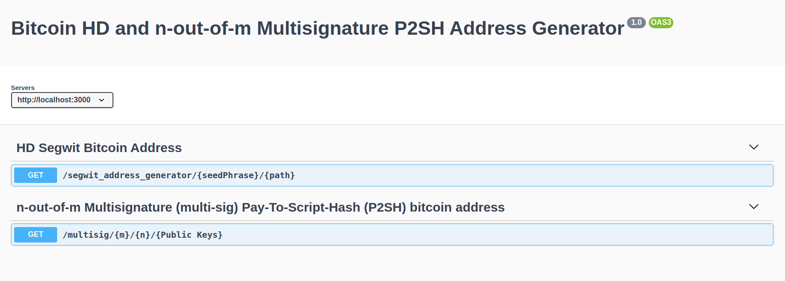

Bitcoin HD and n-out-of-m Multisignature P2SH Address Generator

- [Objective](#objective)
- [Overview about HD SegWit Bitcoin Addresses](#overview-about-hd-segwit-bitcoin-addresses)
- [P2SH n-m multi-sig bitcoin address](#p2sh-n-m-multi-sig-bitcoin-address)
- [Installation](#installation)
- [Usage](#usage)
- [Demo](#demo)
- [Correctness for the addresses and points of validation](#correctness-for-the-addresses-and-points-of-validation)
- [Improvements](#improvements)


## Objective
To create an API server preferably in Typescript that supports the following operations: 
1. Generate a Hierarchical Deterministic (HD) Segregated Witness (SegWit) bitcoin address from a given seed and path
2. Generate an n-out-of-m Multisignature (multi-sig) Pay-To-Script-Hash (P2SH) bitcoin address, where n, m, and addresses can be specified 
 
## Overview about HD SegWit Bitcoin Addresses
   * The public/private combination mechanisms ensures safety of the cryptocurrency tokens but comes with an additional overhead of the user being required to repeatedly generate a random pair of private/public addresses (or keys), and back up each time one configures a new pair of addresses. As the number of transactions increases, this process becomes cumbersome for the user.
   * HD Wallets, or Hierarchical Deterministic wallets, solve this problem by deriving all the addresses from **a single master seed (hence the name hierarchical). All HD wallets use a variant of the standard 12-word master seed key,** and each time this seed is extended at the end by a counter value which makes it possible to automatically derive an unlimited number of new addresses.
   * [BIP 32]('https://github.com/bitcoin/bips/blob/master/bip-0032.mediawiki') talks about the HD wallets proposal and usage in more details
 
## P2SH n-m multi-sig bitcoin address
## Installation
```
    npm install
```    
 This would install the necessary packages and libraries for address generation.
This project uses bitcoinjs-lib as the core library for generating bitcoin addresses.   
## Usage
```
For development
    npm run dev
For production
    npm run start
```
This would start the API server hosting the open API documentation.
To test and see the usage,
Go to: 
http://localhost:3000/api-docs

## Demo
If everything goes well,
you will have a page like this:



1. API request 1 HD Segwit Bitcoin Address 

    [API1](images/api1.webm)

    
2. API request 2 for multi-sig address generation
   [API2](images/api2.webm)
## Correctness for the addresses and points of validation
   * Segwit Address Generation:
     * It is expected to pass on the seed phrase and derivation path for the API request, for a good security practice, HD wallets must always consist of seed phrase with length of words greater than or equal to 12. The larger the seed phrase, better the security of the address as it would be more complex to derive the generated addresses.
     * Segwit - address consits of two types: 
       * 'bc1' prefixed Native Segwit (bech-32)
       * '3' prefixed nested segwit (p2wpkh-p2sh)
     * Derivation Path: 
       * The actual keys are then generated according to the following structure:
          * m/44'/0'/0': BIP 44 ('1 addresses')
          * m/49'/0'/0': BIP 49 ('3 addresses p2wpkh-p2sh)
          * m/84'/0'/0': BIP 84 ('bc1' addresses  P2WPKH)
## Improvements
* To generate the dynamic QR codes for the addresses generated and client application
* Using Dynamic random seed generation for encrpytion level enhancements at production level when we are looking at client side applicaiton but this is beyond the scope for this assignment
* Some of the good practices followed are with important status response code specifying the exact error which may be human-readable and easy to debug and address.
